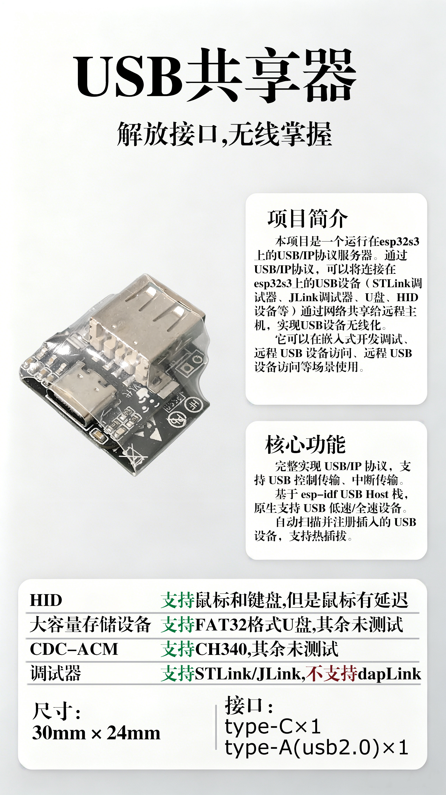

# ESP32 usb over ip

**一个基于开源项目 [usbipdcpp_esp32](https://github.com/yunsmall/usbipdcpp_esp32) 的增强版本，专注于优化和稳定 USB/IP 协议在 ESP32S3 上的数据传输。**
原项目实现了基础框架。本项目**着重解决了在实际应用中遇到的数据传输稳定性、兼容性和性能瓶颈问题**，旨在提供一个可用于更稳定场景的生产力工具或开发基础。

## 📑 目录
- [✨ 主要特性与增强](#-主要特性与增强)
- [🚀 快速开始](#-快速开始)
- [📊 更新日志](#-更新日志)
- [📝 许可证与致谢](#-许可证与致谢)
- [💡 开发透明度声明](#-开发透明度声明)

---

## ✨ 主要特性
- ST-LinkV2 支持，烧录f1芯片最快25秒，平均时长30秒
- J-Link 支持，烧录mspm0g3507需要31秒
- Daplink **不支持**
- 串口 支持，使用时可能会显示超时
- 有线鼠标/键盘 支持，受网络环境影响可能会出现卡顿
- U盘 **部分支持**,读卡器虽能显示在设备列表，但无法连接。写入较大文件（>60kb）会出错，连接时可能因设别内存不足而失败
---

## 🚀 快速开始
1.  **硬件准备**：一个esp32s3，我使用的型号是N16R8，只有*IO18、19*是必须使用的，其余引脚只是用于LED指示和按钮检测。
2.  **软件准备**：安装ESP-IDF V5.5.1。
3.  **获取代码**：`git clone https://github.com/psdscsv/esp32_usb_over_ip.git`
4.  **配置项目**：进入目录，运行 `idf.py set-target esp32s3`选择开发板。
5.  **编译与烧录**：编译烧录...
6.  **网络连接**：可以设置设备连接电脑的热点（速度稍慢），也可以直接连接设备的热点（名称：“登录-192.168.4.1”，速度最快）
7.  **客户端连接**：往设备插入一个usb设备，在 windows的usbip_win2 客户端连接 ESP32-S3 的 IP 地址（如果是设备连接电脑热点，可以在电脑的热点设置找到设备的ip；如果是电脑连接设备热点，输入192.168.4.1即可）。
---

## 📊 更新日志
### [v0.2.5] - 2026-5-15
#### 传输稳定性修复+
- **完全修复了actual_length字段与实际数据不一致的协议错误，这次是真的修好了**
- 测试共享stLink进行烧录，数十次测试的结果是没有出现timeout现象，并且烧录时间在30秒左右

### [v0.2.4] - 2026-5-14
#### 传输稳定性修复
- **修复了 IN 传输 actual_length 字段与实际数据不一致的协议错误，同时提升传输速度**
- 目前做了强制性修复，后续将修复长度计算逻辑
- esp32电压问题，更有可能来自本人焊接，更换另一个板子就没有出现问题
- 在连接stLink进行烧录，时间从39-45秒降低至30秒！！！

### [v0.2.3] - 2026-5-13
#### 参数优化+问题排查
- **调整menuconfig的参数以提升传输速率，但是这也导致了稳定下降**
- 在传输过程中，指示灯（现在是换成一个LED）会出现亮度变化，猜测传输过程需要较大电流导致供电不足
- esp32有可能在传输过程中因电压跌落重启，目前的PCB设计需要修改！！
- 在连接stLink进行烧录的时候，第一次经常出现timeout的错误，再次烧录速度会更快一些（献祭有加成？？）

*[查看完整更新历史](changelog.md)*
---

## 📝 许可证与致谢

### 许可证
*   本项目基于 **Apache License Version 2.0** 开源。

### 致谢
*   衷心感谢原项目作者 [yunsmall](https://github.com/yunsmall) 及的工作。
*   感谢 USB/IP 协议的开源社区及 Espressif 提供的 ESP-IDF 框架。

---

## 💡 开发透明度声明

本项目在开发过程中，使用了 AI 编程助手进行部分代码的构思、重构和文档撰写，以提高开发效率。**项目的核心逻辑、关键优化及最终实现均由开发者验证、测试并负责。**
*这段话也是AI生成的*